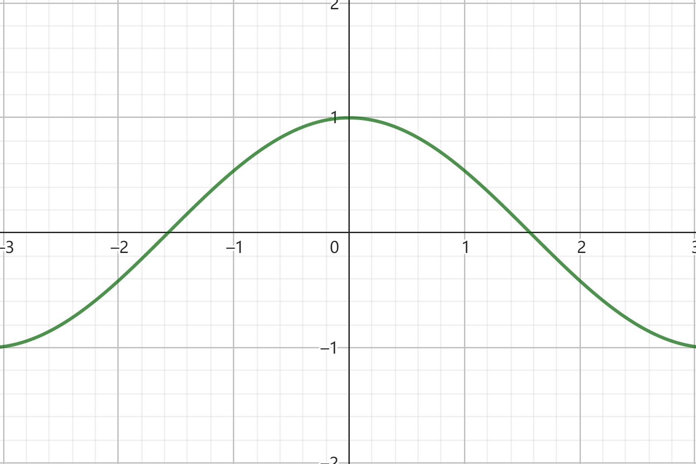
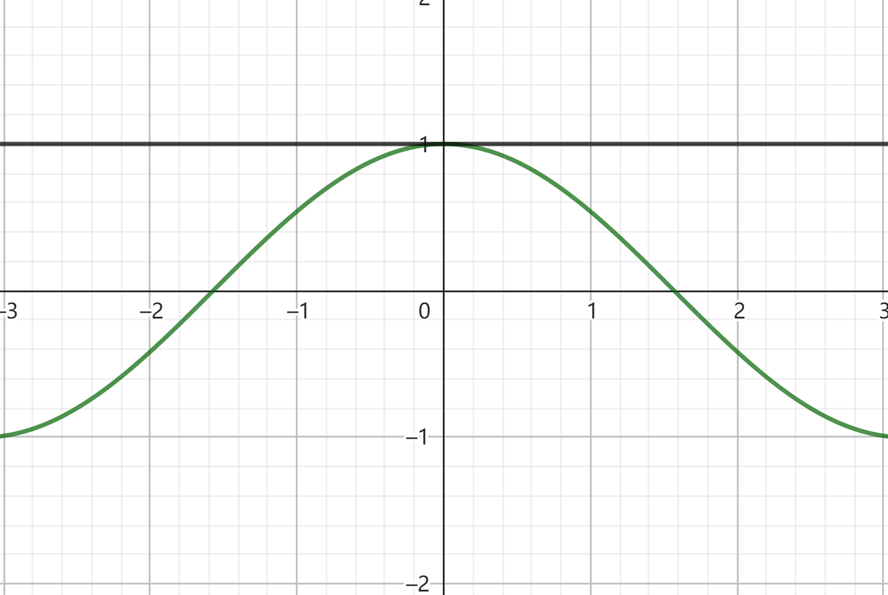
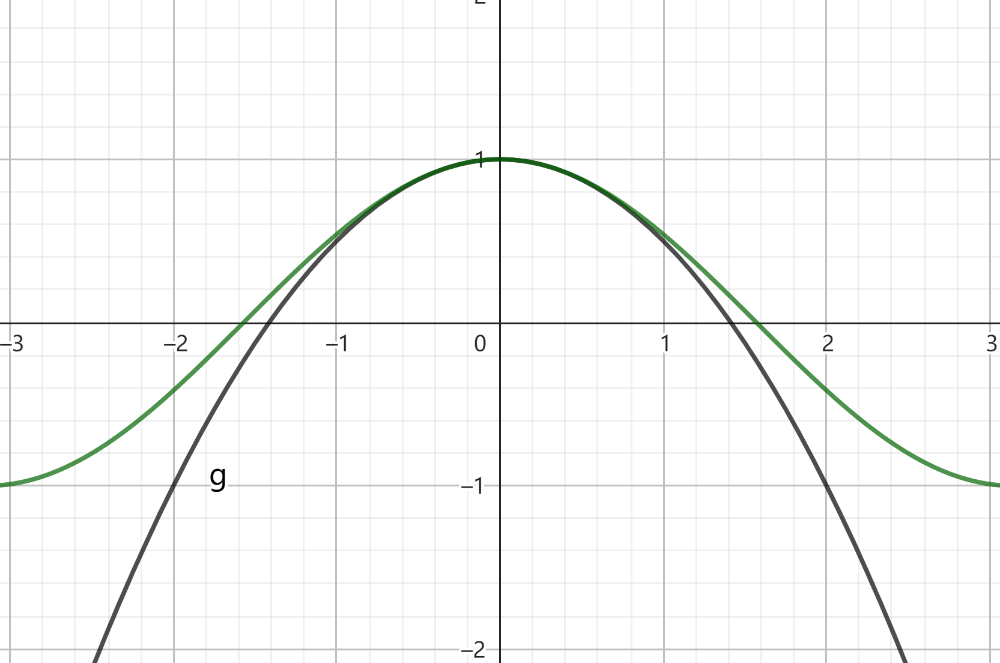
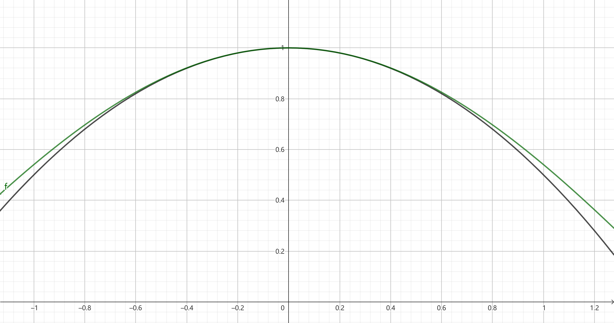

## 1. 引入

在数学学习中，我们总是与各式各样的函数打交道，显然我们希望每一次遇到的函数都是类似于 $y = a + bx + cx^2 + \dotsc + zx^n$ 的形式。

> 如果你忘了什么是函数，请出门过墙查看 [函数](https://zh.wikipedia.org/wiki/%E5%87%BD%E6%95%B0)

那么对于任何一个函数 $f(x)$，我们是否能够写出一个多项式函数 $g(x)$ 来表示它？即使是对于 $f(x) = \sin x$ 这类函数而言？

有！

这就是即将到来的泰勒展开 $\to$

## 2. 定义

若函数 $f(x)$ 在 $x_0$ 处任意阶可导，那么对于 $\forall x \in (a, b)$，有：

$$f(x) = \frac{f(x_0)}{0!} + \frac{f'(x_0)}{1!}(x - x_0) + \frac{f''(x_0)}{2!}(x - x_0)^2 + \dotsc + \frac{f^{(n)}(x_0)}{n!}(x - x_0)^n + \R_n(x)$$

其中 $\R_n(x)$ 为余项，稍后会给出解释。

看不懂？那就把它扔了，让我们从例子出发 $\to$

## 3. 例子

先来看一个最熟悉的例子：

这是 $f(x) = \cos x$ 的图像。

尝试考虑用一个多项式来代替它。
 
1. 设一个二次多项式 $g(x) = c_0 + c_1x + c_2x^2$ 在 $x = 0$ 处值为 $1$ 且变化趋势与 $f(x) = \cos x$ 相似。

显然常数项 $c_0$ 必定为 $1$，若不考虑 $c_1, c_2$，此时函数 $g(x)$ 的图像为：

此时，无论 $c_1, c_2$ 取何值，我们总可以保证函数 $g(x)$ 在 $x = 0$ 处值取 $1$。

2. 考虑一次项系数 $c_1$：

接着，我们试图让 $g(x)$ 在 $x = 0$ 处的变化率与 $f(x)$ 的相同，即对 $f(x)$ 和 $g(x)$ 求导：

$$\begin{cases}
    f'(x) = - \sin x \\
    g'(x) = c_1 + 2c_2x
\end{cases}$$

当 $x = 0$ 时：

$$\begin{cases}
    f'(x) = 0 \\
    g'(x) = c_1
\end{cases}$$

由此可以确定 $c_1 = 0$，若不考虑 $c_2$，此时函数图像与前一张相同。

3. 考虑二次项系数 $c_2$：

类似于第 $2$ 步，我们尝试让 $g(x)$ 在 $x = 0$ 处的变化率的变化率与 $f(x)$ 的相同，即对 $f'(x)$ 和 $g'(x)$ 求导：

$$\begin{cases}
    f''(x) = - \cos x \\
    g''(x) = 2c_2
\end{cases}$$

> 观察 $f(x)$ 的图像，尽管它在 $x = 0$ 处的变化率为 $0$，但这个变化率有减小的趋势，转化到图像上表现为函数 $f(x)$ 在 $x = 0$ 附近向上凸。
>
> 这就是二阶导与函数凹凸性之间的关系。

当 $x = 0$ 时：

$$\begin{cases}
    f''(x) = -1 \\
    g''(x) = 2c_2
\end{cases}$$

由此可以确定 $c_2 = -\frac{1}{2}$，此时函数图像为：

若将函数图像放大，可以确定 $g(x)$ 在区间 $[-0.5, 0.5]$ 附近与 $f(x)$ 是相对吻合的：

也就是说，我们可以用 $g(x) = 1 + -\frac{x^2}{2}$ 来近似计算函数 $f(x) = \cos x$ 在区间 $[-0.5, 0.5]$ 的值

## 4.回顾

刚刚，我们用一个二次多项式 $g(x)$ 近似代替了函数 $f(x) = \cos x$ 在 $x = 0$ 附近的取值，

如果更进一步，用三次多项式、四次多项式来代替呢？甚至是 $n$ 次多项式呢？

那你就得到了 $f(x) = \cos x$ 的泰勒展开式：

$$f(x) = 1 + \frac{0}{1!}x + \frac{-1}{2!}x^2 + \frac{0}{3!}x^3 + \dotsc$$

形式化一下：

$$f(x) = \frac{f(x)}{0!} + \frac{f'(x)}{1!}x + \frac{f''(x)}{2!}x^2 + \dotsc + \frac{f^{(n)}(x)}{n!}x^n $$

显然这个展开式的形式与文章开头的不太一样，下面一一解释：

* 对于系数 $c_n= \frac{1}{n!}$，这是在求 $x^n$ 的导数时所带来的，举个例子：
  * 对于 $y = x^n$，其导数为 $y' = (n - 1)^{n- 1}$，因此：
    * $f(x) = c_0 + c_{1}x + c_{2}x^{2} + c_{3}x^{3} + \dotsc$
    * $f'(x) = 1 \times c_{1} + 1 \times c_{2}x + 1 \times c_{3}x^{2} + \dotsc$
    * $f''(x) = 1 \times 2 \times c_{2} + 1 \times 2 \times c_{3}x \dotsc$
    * $f'''(x) = 1 \times 2 \times 3 \times c_{3} + \dotsc$
    * $\dotsc$
    * $f^{(n)}(x) = n! \times c_{n}$
  * 所以：
    * $c_0 = \frac{f(x)}{0!}$
    * $c_1 = \frac{f'(x)}{1!}$
    * $c_2 = \frac{f''(x)}{2!}$
    * $c_3 = \frac{f'''(x)}{3!}$
    * $\dotsc$
    * $c_{n} = \frac{f^{(n)}(x)}{n!}$
* 对于 $(x - x_0)$
  * 由刚刚的推导过程可知，我们只考虑了在 $x = 0$ 附近求近似这一特殊情况，那么如果我们想在 $x = a$ 附近求近似呢？
  * 那就设一个 $x_0 = a$，然后将原来的 $x$ 转化成 $(x - x_0)$ 即可。
* 对于余项 $\R_n(x)$
  * 显然，无论我们怎么逼近，展开多少项，总会存在一个逐渐变小的误差，我们将这些误差统一归纳到最后一项里，即：
  * $\R_n = f(x) - g_n(x)$

## 5.总结

恭喜，你已经自主推导出泰勒展开的一种形式，下面给出一些严谨的泰勒公式
 
1. 若函数 $f(x)$ 在 $x_0$ 处有 $n$ 阶导数，那么存在 $x_0$ 的一个邻域，对 $\forall x \in U(x_0)$，有

$$f(x) = \frac{f(x_0)}{0!} + \frac{f'(x_0)}{1!}(x - x_0) + \frac{f''(x_0)}{2!}(x - x_0)^2 + \dotsc + \frac{f^{(n)}(x_0)}{n!}(x - x_0)^n + \R_n(x)$$

该公式称为函数 $f(x)$ 在 $x_0$ 处，带有佩亚诺(Peano)余项的 $n$ 阶泰勒公式展开。

其中：

$$\R_n(x) = o({(x - x_0)}^n)$$

称为佩亚诺余项。

2. 若函数 $f(x)$ 在 $x_0$ 处有 $n$ 阶导数，那么存在 $x_0$ 的一个邻域，对 $\forall x \in U(x_0)$，有
   
$$f(x) = \frac{f(x_0)}{0!} + \frac{f'(x_0)}{1!}(x - x_0) + \frac{f''(x_0)}{2!}(x - x_0)^2 + \dotsc + \frac{f^{(n)}(x_0)}{n!}(x - x_0)^n + \R_n(x)$$

该公式称为函数 $f(x)$ 在 $x_0$ 处，带有拉格朗日(Lagrange)余项的 $n$ 阶泰勒公式展开。

其中：

$$\R_n(x) = \frac{f^{(n + 1)}(\xi)}{(n + 1)!}(x - x_0)^{n + 1}(\xi \in (x, x_0))$$

称为拉格朗日余项。

当 $n = 0$ 时，该公式变为拉格朗日中值定理公式：

$$f(x) = f(x_0) + f'(\xi)(x - x_0)(\xi \in (x, x_0))$$

3. 若上述公式中 $x_0 = 0$，那么它们被称为麦克劳林公式，即

- 带有佩亚诺余项的麦克劳林公式：

$$f(x) = \frac{f(0)}{0!} + \frac{f'(0)}{1!}x + \frac{f''(0)}{2!}x^2 + \dotsc + \frac{f^{(n)}(0)}{n!}x^n + o(x^n)$$

- 带有拉格朗日余项的麦克劳林公式：

$$f(x) = \frac{f(0)}{0!} + \frac{f'(0)}{1!}x + \frac{f''(0)}{2!}x^2 + \dotsc + \frac{f^{(n)}(0)}{n!}x^n + \frac{f^{(n + 1)}(\xi x)}{(n + 1)!}x^{n + 1}, \xi \in (0, 1)$$

4. 若不带余项，那么称

$$T_n(x) = \frac{f(x_0)}{0!} + \frac{f'(x_0)}{1!}(x - x_0) + \frac{f''(x_0)}{2!}(x - x_0)^2 + \dotsc + \frac{f^{(n)}(x_0)}{n!}(x - x_0)^n$$

为函数 $f(x)$ 在点 $x_0$ 处的 $n$ 阶泰勒展开式。

其误差估计式为：

$$\lvert \R_n(x) \rvert \le \frac{M}{(n + 1)!}x^{n + 1}$$

5. 对于余项，还有其他表示方式，如：

- 柯西(Cauchy)余项：

$$\R_n(x) = f^{(n + 1)}[x_0 + \theta (x - x_0)] \frac{(1 - \theta)^{n}(x - x_0)^{n + 1}}{n!}$$

- 施勒米尔希-罗什(Schlomilch-Roche)余项：

$$\R_n(x) = f^{(n + 1)}[x_0 + \theta (x - x_0)] \frac{(1 - \theta)^{n + 1 - p}(x - x_0)^{n + 1}}{n!p}(\theta \in (0, 1), p \in Z, p > 0)$$

其中当 $p = n + 1$ 时对应拉格朗日余项，$p = 1$ 时对应柯西余项。

- 积分余项：

$$R_n(x) = \frac{(-1)^n}{n!} \int^x_a(t - x)^nf^{(n + 1)}(t)dt$$

~~显然绝大多数余项事实上等价~~

6. 给出一些常用函数的泰勒展开：

$$\begin{aligned}
    e^x &= \sum_{n = 0}^{\infty} \frac{1}{n!} x^n = 1 + x + \frac{1}{2!} x^2 + \cdots , x \in (- \infty, + \infty) \\
    \sin x &= \sum_{n = 0}^{\infty} \frac{(-1)^n}{(2n + 1)!} x^{2n + 1} = x - \frac{1}{3!} x^3 + \frac{1}{5!} x^5 + \cdots, x \in (- \infty, + \infty) \\
    \cos x &= \sum_{n = 0}^{\infty} \frac{(-1)^n}{(2n)!} x^{2n} = 1 - \frac{1}{2!} x^2 + \frac{1}{4!} x^4 + \cdots, x \in (- \infty, + \infty) \\
    \ln (1 + x) &= \sum_{n = 0}^{\infty} \frac{(-1)^n}{n + 1} x^{n + 1} = x - \frac{1}{2} x^2 + \frac{1}{3} x^3 + \cdots, x \in (-1,1] \\
    \frac{1}{1 - x} &= \sum_{n = 0}^{\infty} x^n = 1 + x + x^2 + x^3 + \cdots, x \in (-1,1) \\
    \frac{1}{1 + x} &= \sum_{n = 0}^{\infty}(-1)^n x^n = 1 - x + x^2 - x^3 + \cdots, x \in (-1,1)\\
    (1 + x)^{\alpha} &= 1 + \sum_{n = 1}^{\infty} \frac{\alpha(\alpha - 1) \cdots(\alpha - n + 1)}{n!} x^n = 1 + \alpha x + \frac{\alpha(\alpha-1)}{2!} x^2 + \cdots, x \in (-1, 1) \\ 
    \tan x &= \sum_{n = 1}^{\infty} \frac{B_{2n}(-4)^n \left (1 - 4^n \right)}{(2n)!} x^{2n - 1} = x + \frac{1}{3} x^3 + \frac{2}{15} x^5 + \frac{17}{315} x^7 + \frac{62}{2835} x^9 + \frac{1382}{155925} x^{11} + \frac{21844}{6081075} x^{13} + \frac{929569}{638512875} x^{15} + \cdots,x\in (- \frac{\pi}{2}, \frac{\pi}{2})
\end{aligned}$$

7. 泰勒展开式的重要性体现在以下几个方面：

- 函数近似：
   - 泰勒展开允许我们用多项式函数来近似复杂函数，这在很多情况下能大大简化计算。

- 误差分析：
   - 泰勒展开为我们提供了一种系统的方法来分析近似值与真实值之间的误差。

- 极限计算：
   - 可以帮助我们处理一些不定型极限。

- 微分方程：
   - 在求解微分方程时，泰勒展开可以用来构造级数解，尤其是对于那些无法用初等函数表示的解。

- 物理学应用：
   - 在物理学中，泰勒展开被广泛用于处理小量，例如在经典力学和量子力学中。

- 信号处理：
   - 在信号处理中，泰勒展开用于分析和设计滤波器，也对信号的频域分析中有重要作用。

- 优化理论：
   - 在优化算法中，目标函数的泰勒展开常用于构造近似模型，这在诸如牛顿法等迭代优化方法中尤为重要。

- 计算机科学：
   - 在计算机图形学中，泰勒展开用于近似复杂的光照模型和几何变换。
   - 在计算机科学中，复杂函数的泰勒多项式近似可以显著提高计算效率。