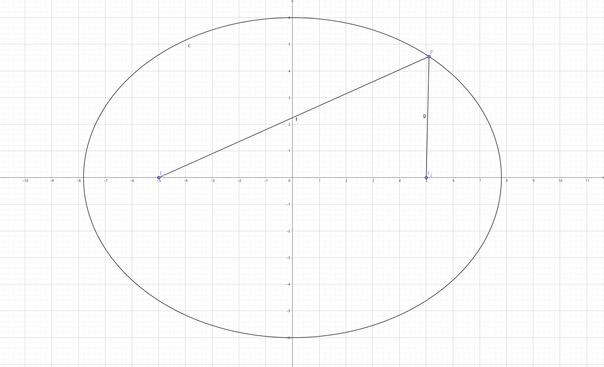

## 1.引入

​从初中学起的几何应被称为立体几何和平面几何，而在数学选必二中提到的[解析几何](https://zh.wikipedia.org/wiki/解析几何)（又称为笛卡尔几何）则是与立体几何、平面几何相平级的，有关几何学的一个分支。

​解析几何是平面几何的另一种表示方式，换句话说，平面几何中的绝大多数内容，在解析几何中同样可以表示出来，而它的优点在于，它将原先的需要直观感受、操作确认的平面图形转化成了一个个解析式，让我们不再需要用类似于直觉的方法来推断，而是通过观察代数式之间的关系来推断几何图形之间的关系，这对于那些擅长代数但无法顺利思考几何图形的同学来说可能是一种救赎。

​解析几何的来源是1673年[笛卡尔](https://zh.wikipedia.org/wiki/笛卡兒)在《[方法论](https://zh.wikipedia.org/wiki/方法论)》的附录“几何”中提出了解析几何的基本方法。

## 2.讲解

​之所以我们能用解析式来代替平面几何图形，是因为二维平面直角坐标系，它将平面中的一个个点转化为一个个实数对，从而让我们能够用解析式来表达几何图形。

### 直线

我们都知道，两点确定一条直线，换个说法，一个点和一个方向确定一条直线，那么，方向如何确定？

我们规定一条直线在 $x$ 轴上方的部分和 $x$ 轴正方向所构成的角称为直线的倾斜角，如下图：

其中 $\alpha$ 和 $\beta$ 分别为直线 $l_1$ 和直线 $l_2$ 的倾斜角

**注意：倾斜角可以是钝角，也可以与直线平行（是0度角）**，即直线的倾斜角 $\alpha \in [0, \pi)$

当然，一个角度无法简单的成为解析式中的一个常量，我们需要对其进行转化，联系两点确定一条直线，我们随意选取直线 $l$ 上不同的两点 $P_1(x_1, x_2)$ 和 $P_2(x_2, y_2)(y_1 > y_2)$，由于直线 $l$ 确定时倾斜角 $\alpha$ 跟着确定，可以断定两个点的坐标之间一定存在某种关系。

可以看出，倾斜角描述的是直线的倾斜趋势，类似的，我们可以用直线在单位长度内上升的高度来刻画直线的倾斜趋势，即 $\frac{y_1 - y_2}{x_1 - x_2}$，显然在 $\alpha \in [0, \frac{\pi}{2})$ 时这是正切的定义，如果$\alpha \in (\frac{\pi}{2}, \pi)$ 呢？

此时 $\tan \alpha = \frac{y_1 - y_2}{x_1 - x_2}$，对分式上下同乘 $-1$ 即可得到原来的式子。

我们定义一条直线的斜率为这条直线的倾斜角的正切值，即：

$$k = \tan \alpha = \frac{y_2 - y_1}{x_2 - x_1}$$

显然，$\alpha = \frac{\pi}{2}$ 的直线没有斜率，因为我们无法用一个数来表示一条能在一单位长度内上升无限高度的直线（~~其实就是tan在此时没有定义~~）

同时，给出两直线平行的判定条件：

$$l_1 // l_2 \Leftrightarrow k_1 = k_2$$

由于当且仅当 $\alpha = \frac{\pi}{2}$ 时不存在斜率，那么如果两条直线都不存在斜率，这两条直线显然也平行。

若两条直线重合，这算是平行的一种形式，显然存在 $k_1 = k_2$，这可用于证明三点共线，即：

设 $P_1(x_1, y_1), P_2(x_2, y_2), P_3(x_3, y_3)$，且三点各不相同，则：

$$\frac{y_1 - y_2}{x_1 - x_2} = \frac{y_2 - y_3}{x_2 - x_3} \Leftrightarrow P_1, P_2, P_3三点共线$$

即由点 $P_1(x_1, y_1), P_2(x_2, y_2)$ 构成的直线 $l_1$ 和由点 $P_2(x_2, y_2), P_3(x_3, y_3)$ 构成的直线 $l_2$ 斜率相同。

那么两直线垂直的判定是什么？

设两直线 $l_1, l_2$ 的斜率 $k_1, k_2$，那么两直线的方向向量为 $\vec{a} = (1, k_1), \vec{b} = (1, k_2)$，所以：

$$l_1 \perp l_2 \Leftrightarrow \vec{a} \perp \vec{b} \Leftrightarrow \vec{a} \cdot \vec{b} \Leftrightarrow 1 \times 1 + k_1 k_2 = 0 \Leftrightarrow k_1 k_2 = -1$$

这便是在解析几何中两直线垂直的判定定理。

#### 直线的方程

刚刚我们已经给直线下了一些基本定义，下面我们将尝试用一个解析式来描述二维平面的直线。

##### 点斜式方程

设点 $P(x, y)$ 是直线 $l$ 上的一个动点，如果我们用一个二元一次方程来描述这个点运动过程中的坐标，那么就能描述这一条直线。

结合最开始的斜率，设直线 $l$ 的斜率为 $k$，且有一个定点 $P_0(x_0, y_0)$。

由斜率公式得：

$$k = \frac{y - y_0}{x - x_0}$$

即

$$y - y_0 = k(x - x_0)$$

这被称为直线 $l$ 的点斜式方程，即由一条直线的斜率和直线上一个点的坐标所组成的方程。

##### 斜截式方程

当点 $P$ 在 $y$ 轴上时，其坐标可写为 $(0, b)$，带入点斜式方程后转化为：

$$y - b = k(x - 0)$$ 

即：

$$y = kx + b$$

这是初中非常常见的描述直线的方程，在高中称其为斜截式方程，其中 $b$ 称为直线 $l$ 在 $y$ 轴上的截距。

##### 两点式方程

假如我们不知道直线的斜率但知道直线上两点的坐标呢？

设直线 $l$ 经过不同的两点 $P_1(x_1, y_1), P_2(x_2, y_2)$，显然可以求出其斜率为 $k = \frac{y_2 - y_1}{x_2 - x_1}$，再取点 $P_1$，由点斜式方程可得：

$$y - y_1 = \frac{y_2 - y_1}{x_2 - x_1}(x - x_1)$$

即：

$$\frac{y - y_1}{y_2 - y_1} = \frac{x - x_1}{x_2 - x_1}$$

这被称为直线的两点式方程。（~~就是由两个点可以求出的方程~~）

##### 截距式方程

类似于斜截式方程，我们让点 $P_1, P_2$ 都在坐标轴上，即 $P_1(a, 0), P_2(0, b)$，将其带入两点式方程：

$$\frac{y - 0}{b - 0} = \frac{x - a}{0 - a}$$

即：

$$\frac{x}{a} + \frac{y}{b} = 1$$

这被称为直线的截距式方程，其中 $a$ 被称为直线 $l$ 在 $x$ 轴上的截距，$b$ 为直线 $l$ 在 $y$ 轴上的截距。

##### 一般式方程

不难看出，所有直线的方程都是一个二元一次方程，我们猜测类似于 $Ax + By + C = 0$ 的方程都可以用来表示一条直线。

当 $k$ 存在时，点斜式方程可以化为 $y - kx + (kx_0  - y_0) = 0(k \in R)$。

当 $k$ 不存在时，直线的方程为 $x - x_0 = 0$，或者说 $0 \times y + x - x_0 = 0$。

由此得出，对于任意一个二元一次方程 $Ax + By + C = 0$，在 $A, B$ 不同时为 $0$ 的时候，它可以用于表示一条直线，这是直线的一般式方程。

### 直线和点之间的关系

#### 直线与直线相交

将两条直线 $l_1, l_2$ 写成一般式的形式：

$$\begin{cases}
    l_1 : A_1x + B_1y + C_1 = 0 \\ 
    l_2 : A_2x + B_2y + C_2 = 0 
\end{cases}$$

解这个方程组，有三种可能：

1. 有解，此时 $(x, y)$ 即为 $l_1, l_2$ 的交点坐标。
2. 无解，此时 $l_1 // l_2$。
3. 两方程等价，此时 $l_1$ 与 $l_2$ 重合。

#### 点对之间的距离

设点对 $P_1(x_1, y_1), P_2(x_2, y_2)$，在平面直角坐标系中由勾股定理可得：

$$|P_1P_2| = \sqrt{(x_1 - x_2)^2 + (y_ 1 - y_2)^2}$$

#### 点到直线的距离

设点 $P(x_0, y_0)$，直线 $l : Ax + By + C = 0$，过点 $P$ 作直线 $l$ 的垂线，垂足为 $H(x, y)$。

显然，其可以转换为点 $P$ 和 $H$ 之间的距离，那么就要求出直线 $PH$ 的解析式。

由于直线 $l$ 的斜率为 $-\frac{B}{A}$，那么直线 $PH$ 的斜率为 $\frac{B}{A}$，可得直线 $PH$ 的方程为 $y - y_0 = \frac{B}{A}(x - x_0)$，化简得 $Ay - Ay_0 = Bx - Bx_0$。

联立一下：

$$\begin{cases}
    Ax + By + C = 0 \\ 
    Bx - Bx_0 = Ay - Ay_0\\
    |PH| = \sqrt{(x - x_0)^2 + (y - y_0)^2}
\end{cases}$$

解之得：

$$|PH| = \frac{|Ax_0 + By_0 + C|}{\sqrt{A^2 + B^2}}$$

#### 两条平行直线之间的距离

由于 $l_1 // l_2$，可以得断定两直线的一般式可以化简为如下形式：

$$\begin{cases}
    l_1 = Ax + By + C_1 \\ 
    l_2 = kAx + kBy + C_2
\end{cases}$$

由此可以将 $l_2$ 变为 $Ax + By + \frac{C_2}{k}$，下面我们默认 $C_2 = \frac{C_2}{k}$

取在 $l_1$ 上点 $P_0(x_0, y_0)$，原问题转化为点 $P$ 到直线 $l_2$ 之间的距离，套用上面的公式即可。

$$d = \frac{|Ax_0 + Bx_0 + C_2|}{\sqrt{A^2 + B^2}} = \frac{|C_1 - C_2|}{\sqrt{A^2 + B^2}}$$

### 圆

#### 圆的方程

##### 圆的标准方程

回忆圆的定义，圆是平面上到定点的距离是定长的点的集合，换句话说，想要确定一个圆，我们只要知道它的圆心和半径即可。

设圆心坐标为 $O(x_0, y_0)$，半径为 $r$，由两点间距离公式可得：

$$\sqrt{(x - a)^2 + (y - b)^2} = r$$

两边平方得：

$$(x - a)^2 + (y - b)^2 = r^2$$

这是圆的标准方程。

##### 圆的一般方程

显然，将圆的标准方程展开，可以得到：

$$x^2 + y^2 + Dx + Ey + F = 0$$

那么，反过来是否一定成立呢？

我们将等号左边的式子配方，得：

$$(x + \frac{D}{2})^2 + (y + \frac{E}{2})^2 = \frac{D^2 + E^2 - 4F}{4}$$

显然左边一定大于等于 $0$，由此推断：

1. 当$D^2 + E^2 - 4F > 0$ 时，它代表一个圆心为 $(-\frac{D}{2}, -\frac{E}{2})$，半径为 $\frac{1}{2} \sqrt{D^2 + E^2 - 4F}$ 的圆。
2. 当$D^2 + E^2 - 4F = 0$ 时，它代表一个圆心为 $(-\frac{D}{2}, -\frac{E}{2})$，半径为 $0$ 的圆。（~~不就是点吗~~）
3. 当$D^2 + E^2 - 4F < 0$ 时，方程无实数解，不构成一个图形。

#### 直线与圆的位置关系

联立直线 $l$ 的一般式方程和圆 $C$ 的标准方程：

$$\begin{cases}
    l：Ax + By + C = 0 \\
    C: (x - a)^2 + (y - b)^2 = r^2
\end{cases}$$

显然出现几解就有几个交点，由此可以判断直线与圆的相交情况。

#### 圆与圆的位置关系

联立圆 $C_1, C_2$ 的一般方程：

$$\begin{cases}
    C_1: x^2 + y^2 + D_1x + E_1y + F_1 = 0
    C_2: x^2 + y^2 + D_2x + E_2y + F_2 = 0
\end{cases}$$

消元并求出 $\Delta$，有三种情况：

1. $\Delta > 0$，此时存在两解，即两个圆相交。
2. $\Delta = 0$，此时有且仅有一解，即两个圆相切，如果要判断内切外切，可以将一般方程化为标准方程后观察圆心和半径之间的关系。
3. $\Delta < 0$，此时无解，两个圆相离。

### 圆锥曲线

#### 椭圆

##### 椭圆的标准方程

椭圆的定义是到两个定点的距离之和为定值的点的集合，且定值**大于**两点之间距离。

设点 $F_1(-c, 0), F_2(c, 0)$，点 $P(x, y)$，由定义得 $|F_1P| + |F_2P| > |F_1F_2| = 2a$，如图：

由两点间距离公式可得：

$$|F_1P| + |F_2P| = \sqrt{(x - c)^2 + y ^ 2} + \sqrt{(x + c)^2 + y ^ 2} = 2a$$

化简：

$$(x - c)^2 + y ^ 2 = 4a^2 - 2a\sqrt{(x + c)^2 + y ^ 2} + (x + c)^2 + y ^ 2$$

移项并整理：

$$a^2 - cx = a\sqrt{(x - c)^2 + y^2}$$

再次平方并整理：

$$(a^2 - c^2)x^2 + a^2y^2 = a^2(a^2 - c^2)$$

两边同除 $a^2(a^2 - c^2)$，得：

$$\frac{x^2}{a^2} + \frac{y^2}{a^2 - c^2} = 1$$

当 $P$ 点在 $y$ 轴上时，$a^2 - c^2 = |OP|^2$，设 $|OP| = b$，原式化为：

$$\frac{x^2}{a^2} + \frac{y^2}{b^2} = 1(a > b > 0)$$

这是椭圆的标准方程。

##### 椭圆的性质

###### 范围

由标准方程可知：

$$\frac{x^2}{a^2} = 1 - \frac{y^2}{b^2} \ge 0$$

可得：

$$\begin{cases}
    \frac{y^2}{b^2} \le 1 \\
    \frac{x^2}{a^2} \le 1
\end{cases}$$

所以：

$$\begin{cases}
    -a \le x \ge a \\
    -b \le y \ge b
\end{cases}$$

即椭圆在直线 $x = \pm a$ 和 $y = \pm b$ 围成的框里。

###### 对称性

将 $x$ 用 $-x$ 代换，方程成立，用 $-y$ 代替 $y$ 也一样，所以椭圆关于 $x$ 轴和 $y$ 轴对称。

将 $(x, y)$ 用 $(-x, -y)$ 代替，方程同样成立，所以椭圆还关于原点对称。

###### 顶点

显然椭圆与 $x$ 轴的交点为 $A_1(-a, 0), A_2(a, 0)$，与 $y$ 轴的交点为 $B_1(0, -b), B_2(0, b)$。

###### 离心率

我们描述椭圆时都喜欢用扁这个字，那么如何刻画椭圆的扁圆程度？

观察图像可知，当半长轴的长度一定时，如果焦距的长度越小，椭圆越“圆”。

所以定义离心度 $e = \frac{c}{a}$，显然当 $e$ 越接近 $0$ 时椭圆越圆。

（qwq~ 下面不想写了~~）

#### 双曲线

双曲线的定义是到两个定点的距离之和为定值的点的集合，且定值**小于**两点之间距离。

设点 $F_1(-c, 0), F_2(c, 0)$，点 $P(x, y)$，由定义得 $|F_1P| + |F_2P| < |F_1F_2| = 2a$，如图：

##### 双曲线的标准方程

$$\frac{x^2}{a^2} - \frac{y^2}{b^2} = 1(a > 0, b > 0)$$

#### 抛物线

抛物线的定义是到一个定点和定直线的距离相同的点的集合。

设点 $F(-c, 0), P(x, y)$，直线 $l$，由定义得 $|FP| = |HP|(HP \perp l)$，如图：

##### 抛物线的标准方程

$$y^2 = 2px$$

其中焦点坐标为 $P$，准线 $l$ 的方程为 $x = -\frac{p}{2}$

## 结语

有时间再补剩下的内容吧 (O_w_O)!